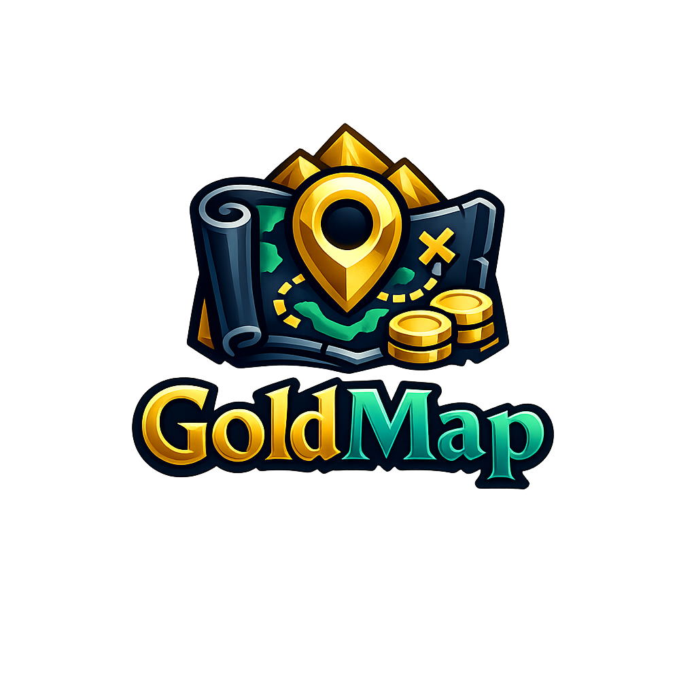

# GoldMap

  

**GoldMap** is a WoW Classic Era addon focused on one goal: help you pick better gold farms, faster.

It overlays profitable targets on the **World Map** and **Minimap** by combining:
- curated mob/gather data (drops, yields, spawn positions)
- your local Auction House market data from **Auctionator**

If you want less guessing and more efficient farming routes, GoldMap is built for that.

## Why GoldMap

- Pin-based farming workflow directly on map and minimap
- Separate support for:
  - mob farms (value per kill)
  - gathering farms (value per node, herbs and ore)
- Rich tooltips with item links, chance/yield, market price, contribution
- Strong filtering with clear labels (non-technical friendly)
- Auctionator-backed market sync with confidence and sell-speed scoring
- Outlier protection: absurd AH listings no longer distort value estimates

## Core Features

- World Map + Minimap pins
- Mob and gathering filters split into dedicated tabs
- Presets + custom presets (save/update/delete)
- Data reliability and selling speed indicators
- Shift details in tooltips for advanced diagnostics
- Scan advisor to suggest when market data is stale
- Always excludes non-attackable/non-practical farm NPCs

## Requirements

- **WoW Classic Era**
- **Auctionator** (required)

Auctionator:
- GitHub: https://github.com/TheMouseNest/Auctionator/
- CurseForge: https://www.curseforge.com/wow/addons/auctionator

## Quick Start

1. Install GoldMap in `Interface/AddOns/GoldMap`
2. Install/enable Auctionator
3. Open game and run `/goldmap`
4. Run an Auctionator scan at AH
5. Run `/goldmap scan` to sync GoldMap prices
6. Open map filters and tune your route

## Filters At A Glance

- **Quick tab**: core constraints for fast setup
- **Mobs tab**: level range, fight type/difficulty, value filters
- **Gathering tab**: node-value filters independent from mobs
- **Advanced tab**:
  - `Match all selected filters (Narrow)`
  - `Match any selected filter (Broad)`
- **Presets tab**: built-in and custom profiles

## Tooltip Labels (Simple Meaning)

- **Estimated Gold**: expected value from chance/yield and market prices
- **Data reliability**:
  - `Unknown`: no market data yet
  - `Low/Medium/High`: confidence based on age/history/exactness/availability signals
- **Likely to sell**:
  - `Low` (red), `Medium` (orange), `High` (green)
- **No price yet**: no usable local market sample for that item yet

GoldMap also applies an anti-outlier guard so one insane auction does not inflate value estimates.

## Commands

- `/goldmap` or `/gmfarm`: open settings
- `/goldmap filters`: open map filter popup
- `/goldmap scan`: sync tracked prices from Auctionator
- `/goldmap advisor`: print advisor status now
- `/goldmap refresh`: force map/minimap refresh
- `/goldmap debug`: toggle GoldMap debug logs
- `/goldmap luadebug`: toggle global Lua errors
- `/goldmap welcome`: show welcome window again

## Development

GoldMap architecture is split by responsibility:
- `Data/`: static seed data (runtime-ready Lua)
- `AHScan/`: Auctionator integration, cache, confidence/sell-speed logic
- `Core/`: initialization, evaluators, runtime events, advisor
- `Map/`: world map and minimap pin rendering
- `UI/`: options, filters, tooltips, overlays

### Suggested Improvements

- Add route optimization pathing between high-value nearby points
- Add smarter per-zone density adaptation based on zoom/context
- Add optional profile export/import for filter presets
- Extend gathering support in future to Fishing and Skinning

## Compatibility

- Target: **WoW Classic Era**
- Not designed for Retail
- Not designed for Season of Discovery

## License

This project is licensed under **GNU GPL v3.0**.  
See `LICENSE`.
